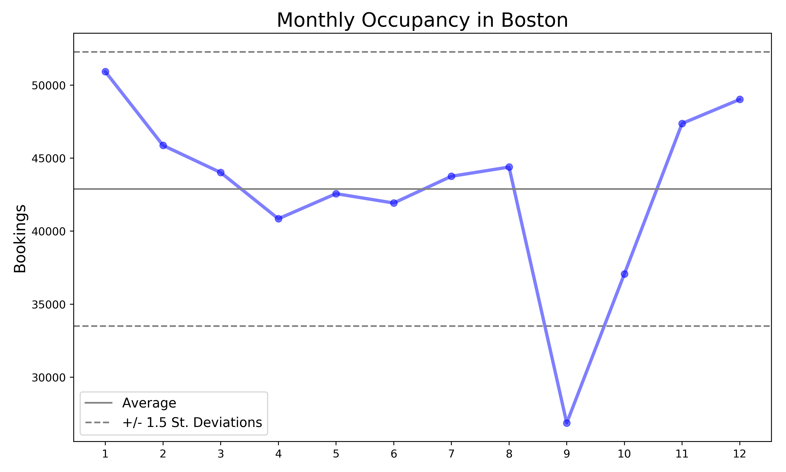

## Boston, The Center of the Universe

## Airbnb Data Challenge
Prepared by **Stuart King** - October 2017  
Objectives:
1. Create a new variable of the annual bookings per listing
2. Create a visualization to show seasonality trends for occupancy in Boston
3. Perform text analysis to extract key neighborhood characteristics

### Table of Contents
- [Background & Data](#background-&-data)
- [Total Bookings by Listing](#total-bookings-by-listing)
- [Occupancy Trends](#occupancy-trends)
- [Text Analysis](#text-analysis)
  * [Tf-Idf](#tf-idf)
  * [KMeans & Tf-Idf](#KMeans-&-tf-idf)
  * [Latent Dirichlet Allocation](#latent-dirichlet-allocation)
- [Next Steps](#next-steps)

### Background & Data
We are given two data files scraped from Airbnb:
* A `listings` dataset that contains a listing's ID and 81 characteristics such as price, description, host response time, host response rate, and more for 3,586 listings in Boston.

* A `calendar` dataset that contains a listing's ID, a date for each day of the year (September 6, 2016 - September 5, 2017), daily availability ('f' if the listing is not occupied on the date or 't' if it is occupied on the date), and the price per night if the listing is occupied.  

Using the provided data, we must complete the following:
1. Using the `calendar` data, sum the number of nights occupied per listing for the entire year, and merge with the listing data

2. Create a visualization to show seasonality trends for occupancy in Boston

3. Select 5 neighborhoods in Boston, referencing the **neighborhood** column in the `listing` dataset, and use text analysis to extract key characteristics of these neighborhoods by using the **neighborhood_overview** and/or **description** columns. Describe your process and create visualizations to support your findings

### Total Bookings by Listing
To accomplish the first task, I created two functions. The first function `prep_data` reads in both datasets as Pandas dataframes, and creates a new Boolean (1/0) feature in the `calendar` dataframe for whether a listing was occupied on a particular date. This function then calls the second function `merge_days_booked` to sum the number of nights occupied for each listing, and then merge the total for each listing with the `listings` dataframe, creating a new feature `days_booked`.
```python
def prep_data():
    '''
    Load the two datasets into Pandas dataframes, and call the
    merge_days_booked() function to update the listings dataframe with the sum
    of nights occupied for each listing.
    '''
    listings = pd.read_csv('data/listings.csv')
    calendar = pd.read_csv('data/calendar.csv')
    calendar.drop_duplicates(inplace=True)

    calendar['booked'] = np.where(calendar['available'] == 't', 1, 0)
    calendar['date'] = pd.to_datetime(calendar['date'],
    infer_datetime_format=True)

    listings_merged = merge_days_booked(listings, calendar)

    return listings_merged, calendar


def merge_days_booked(listings, calendar):
    '''
    Using the calendar data, sum the number of nights occupied, for the entire
    year, per listing ID, and merge with the listing data.
    '''
    cal_grps = calendar.groupby(['listing_id'], as_index=False)['booked'].sum()
    cal_grps = cal_grps.rename(columns={'booked':'days_booked'})

    merged_df = pd.merge(listings, cal_grps, left_on='id',
    right_on='listing_id', how='left')

    merged_df.drop('listing_id', axis=1, inplace=True)

    return merged_df
```
### Occupancy Trends
I explored several options for visualizing seasonality in occupancy trends in Boston. My first attempt was to plot the daily number of bookings between 9/6/16 and 9/5/17. This, however, did not illuminate any discernible trends in the data. I then moved to a month-by-month line graph to demonstrate monthly trends in occupancy. The resultant visualization does appear to highlight a few notable trends, namely that occupancy increased during the winter months, and suffered a significant decline in September-October. This decrease in occupancy in late summer and early fall could correlate with the end of summer holidays and the start of a new school year.



### Text Analysis

#### Tf-Idf

#### Kmeans & Tf-Idf

#### Latent Dirichlet Allocation

### Next Steps
