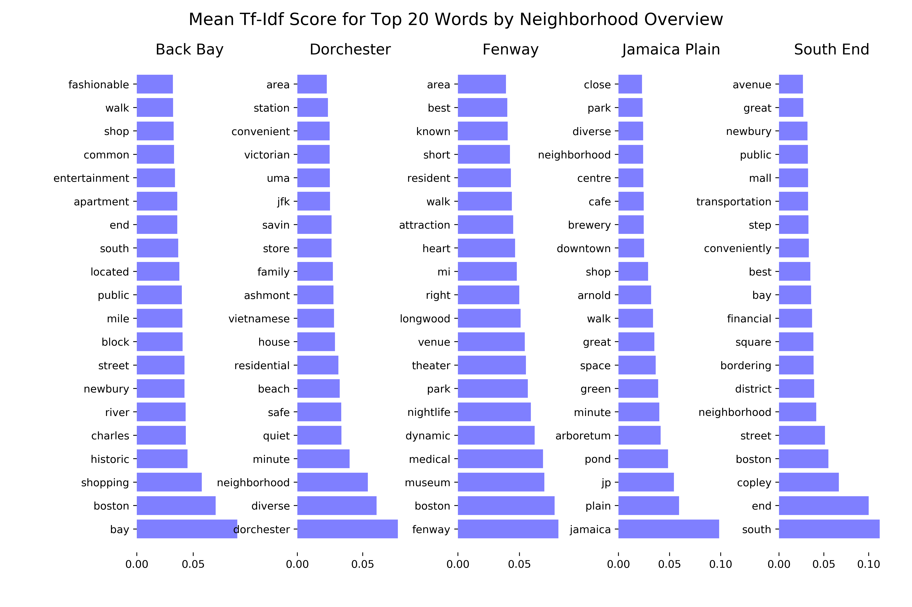

## Boston, The Center of the Universe

## Airbnb Data Challenge
Prepared by **Stuart King** - October 2017  
Objectives:
1. Create a new variable of the annual bookings per listing
2. Create a visualization to show seasonality trends for occupancy in Boston
3. Perform text analysis to extract key neighborhood characteristics

### Table of Contents
- [Background & Data](#background-&-data)
- [Total Bookings by Listing](#total-bookings-by-listing)
- [Occupancy Trends](#occupancy-trends)
- [Text Analysis](#text-analysis)
  * [Tf-Idf](#tf-idf)
  * [KMeans](#kmeans)
  * [Latent Dirichlet Allocation](#latent-dirichlet-allocation)
- [Next Steps](#next-steps)

### Background & Data
We are given two data files scraped from Airbnb:
* A `listings` dataset that contains a listing's ID and 81 characteristics such as price, description, host response time, host response rate, and more for 3,586 listings in Boston.

* A `calendar` dataset that contains a listing's ID, a date for each day of the year (September 6, 2016 - September 5, 2017), daily availability ('f' if the listing is not occupied on the date or 't' if it is occupied on the date), and the price per night if the listing is occupied.  

Using the provided data, we must complete the following:
1. Using the `calendar` data, sum the number of nights occupied per listing for the entire year, and merge with the listing data

2. Create a visualization to show seasonality trends for occupancy in Boston

3. Select 5 neighborhoods in Boston, referencing the **neighborhood** column in the `listing` dataset, and use text analysis to extract key characteristics of these neighborhoods by using the **neighborhood_overview** and/or **description** columns. Describe your process and create visualizations to support your findings.

### Total Bookings by Listing
To accomplish the first task, I created two functions. The first function `prep_data` reads in both datasets as Pandas dataframes, and creates a new Boolean (1/0) feature in the `calendar` dataframe for whether a listing was occupied on a particular date. This function then calls the second function `merge_days_booked` to sum the number of nights occupied for each listing, and then merge the total for each listing with the `listings` dataframe, creating a new feature `days_booked`.
```python
def prep_data():
    '''
    Load the two datasets into Pandas dataframes, and call the
    merge_days_booked() function to update the listings dataframe with the sum
    of nights occupied for each listing.
    '''
    listings = pd.read_csv('data/listings.csv')
    calendar = pd.read_csv('data/calendar.csv')
    calendar.drop_duplicates(inplace=True)

    calendar['booked'] = np.where(calendar['available'] == 't', 1, 0)
    calendar['date'] = pd.to_datetime(calendar['date'],
    infer_datetime_format=True)

    listings_merged = merge_days_booked(listings, calendar)

    return listings_merged, calendar
```
```python
def merge_days_booked(listings, calendar):
    '''
    Using the calendar data, sum the number of nights occupied, for the entire
    year, per listing ID, and merge with the listing data.
    '''
    cal_grps = calendar.groupby(['listing_id'], as_index=False)['booked'].sum()
    cal_grps = cal_grps.rename(columns={'booked':'days_booked'})

    merged_df = pd.merge(listings, cal_grps, left_on='id',
    right_on='listing_id', how='left')

    merged_df.drop('listing_id', axis=1, inplace=True)

    return merged_df
```
### Occupancy Trends
I explored several options for visualizing seasonality in occupancy trends in Boston. My first attempt was to plot the daily number of bookings between 9/6/16 and 9/5/17. This, however, did not illuminate any discernible trends in the data. I then moved to a month-by-month line graph to demonstrate monthly trends in occupancy. The resultant visualization does appear to highlight a few notable trends, namely that occupancy increased during the winter months, and suffered a significant decline in September-October. This decrease in occupancy in late summer and early fall could correlate with the end of summer holidays and the start of a new school year.


### Text Analysis
To properly address the third task of text analysis, I performed multiple topic modeling techniques on the neighborhood overview and description text features of each listing.

#### Tf-Idf
To performed text analysis on the neighborhood overview text corpus of five neighborhoods (Jamaica Plain, South End, Back Bay, Fenway, and Dorchester), I used term frequency-inverse document frequency (Tf-Idf) vectorization. I first tokenized, removed stop-words, and lemmatized the text. I then performed the Tf-Idf transformation using scikit-learn's `TfidfVectorizer`. Following Thomas Buhrmann's blog post, [Analyzing tf-idf results in scikit-learn](https://buhrmann.github.io/tfidf-analysis.html), I then created a function that returned the top 20 words that on average are most important among neighborhood overviews for each neighborhood. Using the resultant visualization of the top 20 words for each neighborhood, I was then able to infer the key characteristics of each neighborhood, as described in the listings' neighborhood overviews.



| Jamaica Plain | South End | Back Bay | Fenway | Dorchester|
| -------------------- | -------------------- | -------------------- | -------------------- | -------------------- |
| Plenty of green space to enjoy, including an arboretum<br><br>Within walking distance to shops and restaurants<br><br>Has a neighborhoody feel and celebrates its diversity | Convenient location with access to public transportation<br><br>Borders several other neighborhoods and districts<br><br>Not characterized by nightlife and entertainment | Popular location for “fashionable” shopping<br><br>Historic vibe close to the Charles River<br><br>Close to other neighborhoods and offers good entertainment | Famous area known for its venues and entertainment<br><br>Home of Fenway Park, good nightlife, and museums<br><br>Walkable and centrally located | Quiet, family-friendly neighborhood<br><br>Historical with Victorian architecture<br><br>Diverse and safe area; conveniently located |

#### KMeans
Extending the Tf-Idf vectorization technique for text analysis, I applied KMeans clustering to the transformed Tf-Idf matrix to perform topic modeling of the listings' descriptions in the five target neighborhoods. Using the scikit-learn `KMeans` clustering algorithm, I partitioned the documents into 10 clusters and returned each cluster's centroid. I then matched the top 10 numbers of each centroid with the corresponding vocabulary words. These top 10 word lists for each cluster then help define the topics present within the text. Examples of the top words in a cluster are provided below.

Cluster #2 | Cluster #4
-------------------- | --------------------
place<br>adventurer<br>solo<br>good<br>traveler<br>business<br>close<br>couple<br>love<br>location | house<br>room<br>floor<br>victorian<br>home<br>family<br>kitchen<br>bedroom<br>bathroom<br>bed

Cluster #2 includes words that describe the **type of traveler** the listing is best suited for, while Cluster #4 includes descriptive words about the **physical space** of the listing.

#### Latent Dirichlet Allocation

Latent Dirichlet Allocation (LDA) is a probabilistic technique for topic modeling. LDA represents documents as mixtures of topics, and assumes a topic can be understood as a collection of words that have different probabilities of appearing in text discussing that topic.

Using the listings' descriptions, I performed 10-topic LDA and created an interactive visualization using the `pyLDAvis` Python library. Please follow the below link to explore the topics discovered in the data using LDA.

<a href="http://ec2-54-163-94-232.compute-1.amazonaws.com:8105/" target="blank">Topic Modeling with LDA</a>

[Topic Modeling with LDA](http://ec2-54-163-94-232.compute-1.amazonaws.com:8105/)

### Next Steps
- The most common terms by neighborhood within the neighborhood overview text field  were helpful in defining key characteristics for each neighborhood. The code could also be used to discover key characteristics of property listings by neighborhood. Furthermore, text analysis such as this on a segment of high-performing listings could likely result in actionable insights for re-branding of lower-performing properties.
- Topic modeling with KMeans can be further expanded by performing a market analysis by cluster and/or neighborhood. Currently my analysis performs topic modeling on all listings’ descriptions in the five target neighborhoods, but the algorithm can be applied to each neighborhood individually to identify common topics unique to that particular neighborhood.
- With more historical data, it is possible to come up with a time-series predictive model for occupancy, as well as a confidence interval around the model’s prediction.
- A custom list of stop-words can likely remove meaningless words such as "Boston".
